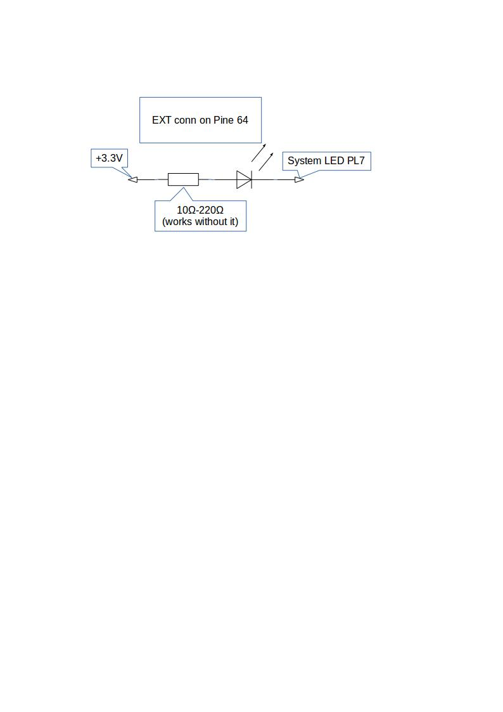

# Sysled for pine64

### Description


I had problems in boot process. Sometimes  my Pine64 boots OK and sometime if freezes in middle of boot process (Possibly hardware or transflash card issue).

Since Pine 64 does not have activity LED, You never know when SBC is ready, so i decided to add System LED.


___
### Installation

To install package just copy script to `/etc/init.d` directory and execute:
```
update-rc.d sysled default
```
____
### Testing

```
/etc/init.d/sysled start
```
to power on System led and
```
/etc/init.d/sysled stop
```
to power off System LED
